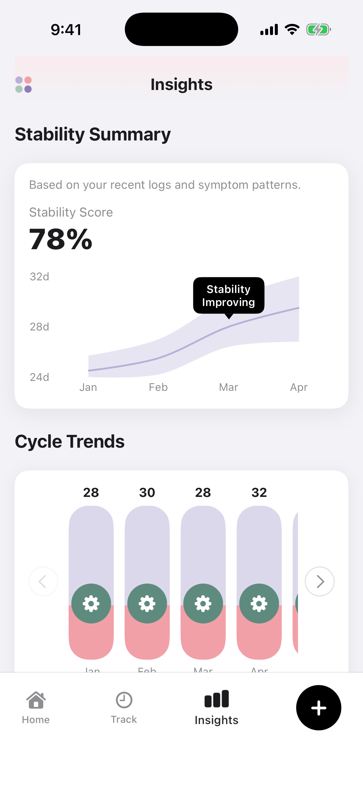

# Cycle Insights

A premium, health-focused iOS application designed to provide deep insights into menstrual cycles, symptom patterns, and lifestyle correlations. Built with a focus on rich aesthetics, interactive charts, and a seamless user experience.

## ✨ Features

- **Stability Summary**: Track your cycle stability with interactive area charts and dynamic trend tooltips.
- **Cycle Trends**: Visualize your cycle length over time with custom-proportioned bar charts and smooth horizontal navigation.
- **Symptom Distribution**: Understand your most frequent symptoms with a beautiful donut chart and detailed breakdown.
- **Lifestyle Impact**: Interactive heatmap correlating sleep, stress, activity, and diet with your cycle health.
- **Health & Vitals**: Track weight changes and other vitals with interactive line and area charts.
- **Premium Design**: Modern, glassmorphic UI with vibrant colors, smooth entrance animations, and a custom-built navigation system.

## Preview

  
  

## 🛠 Tech Stack

- **Core**: Swift, SwiftUI
- **Data Visualization**: Swift Charts
- **Architecture**: MVVM (Model-View-ViewModel)
- **Styling**: Vanilla SwiftUI with custom design tokens and components

## 🚀 Getting Started

1. Open `CycleInsights.xcodeproj` in Xcode 15+.
2. Select a simulator (e.g., iPhone 15 Pro or later).
3. Press `Cmd + R` to build and run.

---
Developed with ❤️ for health transparency.
