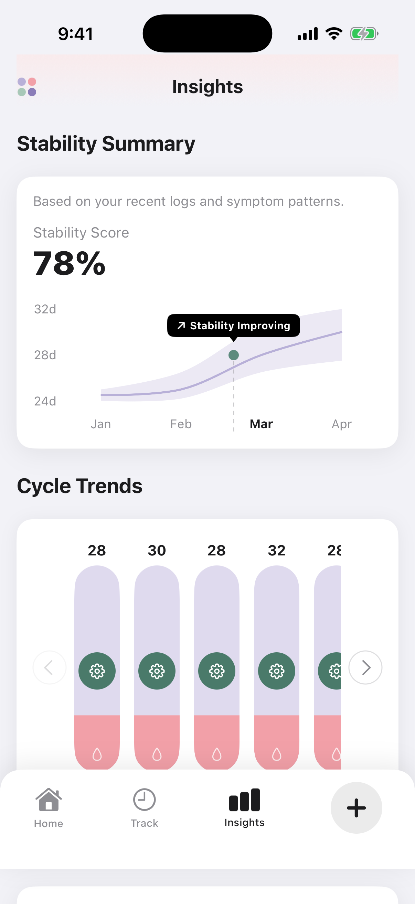
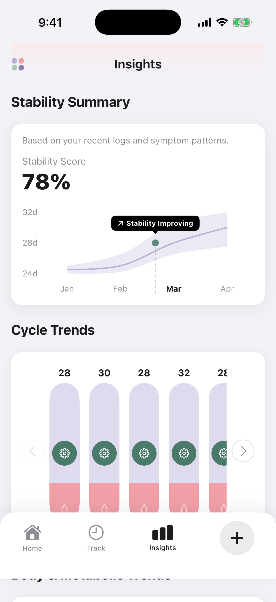

# Cycle Insights

[](https://swift.org)
[](https://developer.apple.com/xcode/swiftui/)
[](https://www.apple.com/ios/)

Cycle Insights is a premium, data-driven menstrual health tracking application for iOS. Designed with precision and modern aesthetics, it provides a holistic view of biological patterns through advanced data visualization and correlation analysis.

## 📺 Project Demo
For a complete walkthrough of the application's features and design, please watch our demo video:
**[Watch Walkthrough Video](https://drive.google.com/file/d/1CIbQYXzI8oVjHonjGFMO23QNJyoKTVRs/view?usp=sharing)**

<p align="center">
  
  
  
</p>

## Overview
In an era of personalized health, Cycle Insights bridges the gap between raw data and actionable intelligence. Built exclusively with **SwiftUI** and **Swift Charts**, the application offers a fluid, interactive experience that makes tracking health metrics both intuitive and visually engaging.

## Core Features

### Stability Summary
Utilizes custom area and line charts to track cycle consistency. The integrated tooltip system provides real-time feedback on stability trends, helping users understand variations in their biological rhythm.

### Cycle Trend Analytics
Visualize cycle length over time with interactive, scrollable bar charts. Designed with a custom-themed design system, these charts provide a clear historical perspective of your reproductive health.

### Body & Metabolic Tracking
Monitor essential vitals such as weight and metabolic signals. The application uses interactive point-mark charts with dashed reference lines to track progress against health goals.

### Symptom Distribution
Identifies recurring patterns using a high-precision donut chart. This visual breakdown helps in understanding which symptoms dominate different phases of the cycle.

### Lifestyle Correlation
A specialized heatmap tracks the correlation between daily habits (Sleep, Hydration, Caffeine, Exercise) and cycle health. This multi-dimensional view enables users to see how their lifestyle choices impact their overall well-being.

## Technical Excellence
- **Native Performance**: Built entirely with Swift and SwiftUI for maximum performance and efficiency.
- **Advanced Visualization**: Leverages the power of Swift Charts for precise and interactive data representation.
- **Modern Design System**: Features a custom-built HSL-based color palette and premium typography for a state-of-the-art user experience.
- **Fluid Animations**: Implemented custom transition and entrance motions for a "premium-feel" navigation.

## Installation
1. **Clone the Repository**:
   ```bash
   git clone https://github.com/MOHITKOURAV01/HiremyideaIOS.git
   ```
2. **Open the Project**:
   Launch `CycleInsights.xcodeproj` in **Xcode 15.0** or later.
3. **Environment**:
   Target **iOS 17.0+** and select a modern simulator (iPhone 15 Pro or newer).
4. **Build & Run**:
   Press `Cmd + R` to experience the application.

---
*Empowering health through transparency and data-driven insights.*
