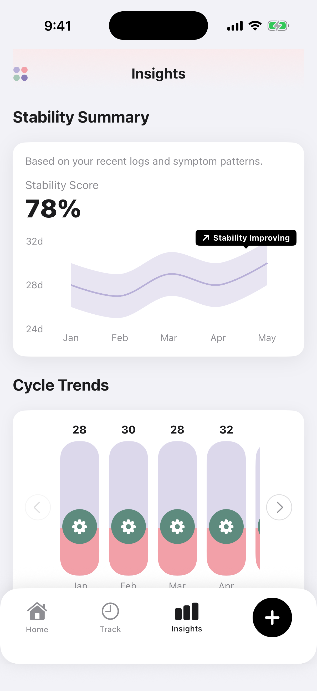
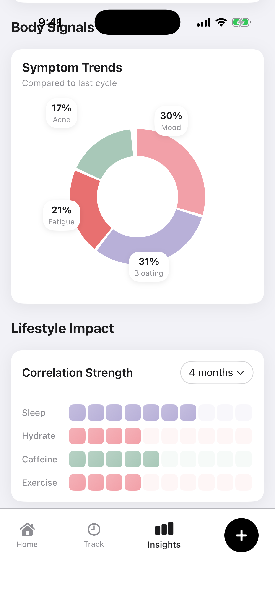

# Cycle Insights

Cycle Insights is a professional-grade menstrual health tracking application for iOS. It leverages data visualization and lifestyle correlation to provide users with a deeper understanding of their biological patterns. The application is built with modern SwiftUI and Swift Charts, focusing on precision, aesthetics, and user engagement.

## Key Features

### Stability Analysis
Monitor your cycle's consistency using interactive area charts. The application identifies patterns and provides dynamic feedback on stability trends over time.

### Cycle Trend Visualization
Track your cycle length across multiple months with custom-designed bar charts. The interactive scrolling interface allows for easy navigation through your historical data.

### Symptom Distribution
A comprehensive donut chart provides a visual breakdown of your most frequent symptoms, helping you identify recurring health patterns within each cycle.

### Lifestyle Correlation
The lifestyle impact heatmap correlates your logs for sleep, stress, activity, and diet with your cycle health, offering a holistic view of your wellbeing.

### Health and Vitals
Dedicated tracking for weight and other essential vitals with interactive line and area charts, ensuring you stay on top of your physical progress.

## Preview

  
  
  

## Technical Specifications

- **Language**: Swift
- **Framework**: SwiftUI
- **Data Visualization**: Swift Charts
- **Architecture**: MVVM
- **UI/UX**: Custom-built design system with a focus on modern aesthetics and smooth animations.

## Getting Started

1. Clone the repository to your local machine.
2. Open `CycleInsights.xcodeproj` in the latest version of Xcode.
3. Select an iOS Simulator (iPhone 15 Pro or later recommended).
4. Build and run the project using Command + R.

---
Developed for health transparency and data-driven insights.
